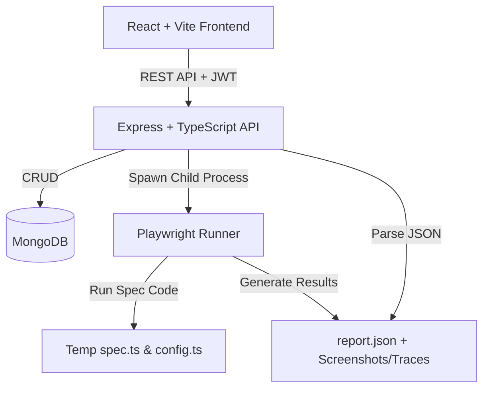

# Omaha — Upstream Test-as-a-Service (TaaS) Platform

Omaha is a full-stack, monorepo web application designed to offer **Test-as-a-Service (TaaS)**. It allows engineers to programmatically author, manage, record, and execute Playwright browser tests across multiple emulation profiles (browsers and devices) while displaying real-time execution statistics, logs, and failure details.

---

## 🏗️ Architecture Overview

The system follows a modular full-stack architecture:



* **Frontend (`/ui-ux`)**: A Vite-powered React single page application styled with Tailwind CSS. It features screen routing via React Router, full Monaco Editor integration for test case scripting, and custom SVG charting for dashboard visualizations (trends, activity heatmaps, and module failure scopes).
* **Backend (`/apis`)**: An Express.js and TypeScript server managing user authentication, test case storage, runner triggers, and static asset serving (execution screenshots/traces).
* **Execution Engine**: Spawns `npx playwright test` as an isolated child process, leveraging generated configurations and custom reporter structures to capture execution stats and errors on the host.
* **Database**: MongoDB (persisted using local collections or an active in-memory instance).

---

## 📂 Repository Structure

```
ohama/
  ├─ apis/                     # Express Backend codebase
  │   ├─ src/
  │   │   ├─ app.ts            # Express configuration & middleware
  │   │   ├─ index.ts          # Express bootloader
  │   │   ├─ config/db.ts      # MongoDB connection helper
  │   │   ├─ models/           # User, TestCase, and TestRun schemas
  │   │   ├─ middleware/       # JWT Auth verification middleware
  │   │   ├─ routes/           # Auth, Tests, Runs, Record, Devices, Dashboard
  │   │   ├─ services/         # Playwright spawn, runner, config generator
  │   │   ├─ scripts/          # Database seeding & memory-DB scripts
  │   │   └─ __tests__/        # Jest API integration tests
  │   ├─ runs/                 # Saved screenshots, videos, and trace zips
  │   ├─ tmp/                  # Temporary spec files generated for runner execution
  │   └─ package.json          # Backend dependencies and scripts
  │
  ├─ ui-ux/                    # React Frontend codebase
  │   ├─ src/
  │   │   ├─ api/              # Axios API client layer with JWT interceptors
  │   │   ├─ components/       # UI Components (Charts, HeroBanner, Sidebar, Views)
  │   │   ├─ context/          # Global AuthContext provider
  │   │   ├─ hooks/            # Data-fetching hooks (useDashboard, useTestCases, etc.)
  │   │   ├─ main.tsx          # Root element setup
  │   │   └─ index.css         # Styling system
  │   └─ package.json          # Frontend dependencies and scripts
  │
  ├─ README.md                 # Root platform documentation
  ├─ API-PLAN.md               # Original Backend technical specification
  └─ UI-PLAN.md                # Original Frontend technical specification
```

---

## ⚙️ Installation & Development Setup

Follow these steps to install and start the platform locally.

### 1. Prerequisites
Ensure you have **Node.js** (v18.x or above) installed. 

### 2. Install Project Dependencies
Run `npm install` inside both project directories:

```bash
# Install backend dependencies
cd apis
npm install

# Install frontend dependencies
cd ../ui-ux
npm install
```

### 3. Install Playwright Web Browsers
Navigate to the `apis` folder and download Playwright browser binaries:

```bash
cd apis
npm run playwright-install
```

### 4. Setup Backend Environment Variables
Create a `.env` file in the `apis` directory:

```env
PORT=5000
MONGO_URI=mongodb://127.0.0.1:27017/playwright-taas
JWT_SECRET=supersecretjwtkey12345
```

---

## 💾 Database Startup & Seeding

The application requires an active MongoDB database. If you do not have a system-wide MongoDB service running, you can launch a local in-memory database using the custom scripts included.

### 1. Start MongoDB In-Memory Server
From the `apis` directory, run:
```bash
npx ts-node src/scripts/run-memory-db.ts
```
This launches a `mongodb-memory-server` instance bound to port `27017` and creates the database `playwright-taas`. Keep this process running.

### 2. Seed the Database with Test Scenarios
Open a new terminal window, navigate to `apis`, and run:
```bash
npx ts-node src/scripts/seed.ts
```
This command populates the database with:
* A default test user: **`test@email.com`** with password **`password123`**.
* **80 Test Cases** (20 cases per scenario: `ERP`, `Accounts Payable`, `Accounts Receivable`, and `Fixed Assets`) with customized tags and realistic Playwright spec scripts.
* **730 Historical Test Runs** spread over the last 30 days to populate dashboard trends and heatmaps.

---

## 🚀 Running the Platform

To run the application, launch both the backend API and the frontend client:

### 1. Start the API Backend
In the `apis` directory, run:
```bash
npm run dev
```
The server will boot and display:
```
Server running on port 5000
MongoDB Connected: 127.0.0.1
```

### 2. Start the React Frontend
In the `ui-ux` directory, run:
```bash
npm run dev
```
The frontend dev server will launch at: `http://localhost:5173/`.

---

## 📡 API Reference Surface

All requests require the `Authorization: Bearer <token>` header, except for registration and login.

### Authentication (`/api/auth`)
* `POST /register` — Register a new account. Body: `{ name, email, password }`
* `POST /login` — Login to obtain JWT. Body: `{ email, password }`
* `GET /me` — Fetch currently authenticated profile details.

### Test Catalog (`/api/tests`)
* `POST /` — Create a test case. Body: `{ name, description?, specCode, targetUrl?, defaultEmulation?, module?, tags? }`
* `GET /` — List authenticated user's test cases.
* `GET /:id` — Get specific test case details.
* `PUT /:id` — Update test metadata or spec script.
* `DELETE /:id` — Delete a test case (cascadingly deletes historical runs and file attachments on disk).

### Executions & Reports (`/api`)
* `POST /tests/:id/run` — Run test case. Body: `{ browser?, device? }` (optional overrides).
* `GET /tests/:id/runs` — Fetch list of execution runs for a test.
* `GET /runs/:runId` — Fetch execution logs and details for a specific run.
* `GET /runs/:runId/artifacts/:fileName` — Serve screenshots/traces statically.

### Interactive Codegen (`/api`)
* `POST /record` — Launches a local browser recorder. Body: `{ url, name }`. Automatically converts actions to test spec scripts.
* `GET /devices` — List of emulator presets.

---

## 🧪 Testing

* **Backend Unit & Integration Tests**: Verify all controllers, models, routing, and runner functions by executing Jest inside `apis`:
  ```bash
  npm test
  ```
