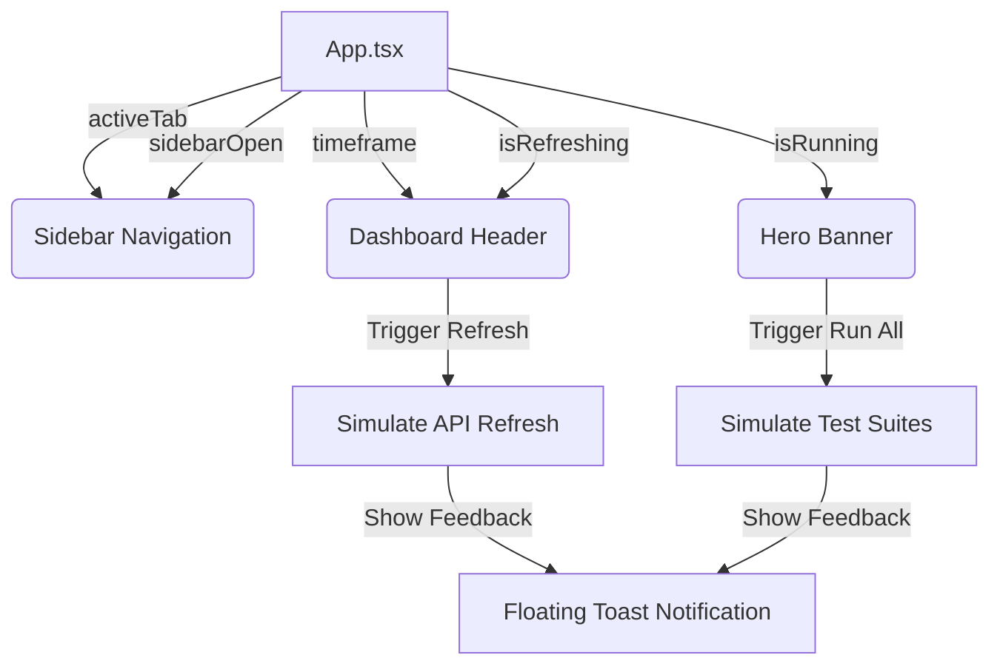

# Omaha Test Monitoring Dashboard — Implementation Walkthrough

This document details the layout architecture, component specifications, and user interaction states of the Omaha Monitoring Dashboard built inside the workspace. The implementation matches high-fidelity specifications from the Figma design (`Node 3863:136`).

## Visual Demonstration

````carousel

<!-- slide -->

````

---

## Technical Stack & Compatibility
- **Framework**: React 18 + TypeScript + Vite 5
- **Styling**: Tailwind CSS v3 (selected to guarantee compilation compatibility with the system's Node `v18.19.1` environment, bypassing Rust native binary dependencies of v4)
- **Icons**: Lucide React (vector-based high-fidelity glyphs representing the sidebar, status cards, and layout buttons)
- **Visualizations**: SVG-based dynamic donut charts and HTML5 flex-stacked bar charts (built with pure Tailwind logic for custom animations and tooltips)

---

## Component Architecture

The dashboard is structured into five modular components:

### 1. Sidebar Navigation
- **Location**: [Sidebar.tsx](file:///home/basant/Desktop/ohama/src/components/Sidebar.tsx)
- **Features**:
  - Organization branding section (`Omaha / prod workspace`).
  - Active-state borders (`border-l-4 border-blue-600`) and soft blue backdrops (`bg-blue-50/80`) to emphasize focus.
  - Grouped categories (`OVERVIEW`, `QUALITY`, `PLATFORM`) and dynamic counters (`Executions: 12`, `Defects: 14`).
  - Slide-out responsiveness (translates offscreen on mobile and overlays with a blurred backdrop).

### 2. Dashboard Header
- **Location**: [Header.tsx](file:///home/basant/Desktop/ohama/src/components/Header.tsx)
- **Features**:
  - Main title (`Monitoring`) and helper subtitle.
  - Timeframe selector pill (`1d`, `7d`, `30d`, `90d`) with black badge tracking.
  - Action buttons (`Refresh`, `Share`) with borders and hover scaling.
  - Hamburger menu toggle to reveal the mobile drawer.

### 3. Hero Release Banner
- **Location**: [HeroBanner.tsx](file:///home/basant/Desktop/ohama/src/components/HeroBanner.tsx)
- **Features**:
  - Horizontal status pills (`Release 2.42 - staging`, `Healthy` status indicator).
  - Prominent metrics sub-banner (`2,847 test cases running across 7 modules`).
  - Primary button (`Run all` execution trigger) and secondary button (`View release`).
  - Embedded vertical KPI list (Today's runs: `592`, Pass rate: `82.4%`, Avg runtime: `4m 12s`) showing positive trends.

### 4. Secondary KPI Row
- **Location**: [KPICards.tsx](file:///home/basant/Desktop/ohama/src/components/KPICards.tsx)
- **Features**:
  - Four metrics cards: `Total Test Cases`, `Automation Coverage`, `Open Defects`, and `Active Suites`.
  - Color-coded trend pills (emerald/red tags indicating growth or critical regressions).
  - Hover micro-scaling on graphic badges (`group-hover:scale-110`) for improved interactivity.

### 5. Visualizations & Analytical Charts
- **Location**: [Charts.tsx](file:///home/basant/Desktop/ohama/src/components/Charts.tsx)
- **Features**:
  - **Execution Results (Donut Chart)**: Rendered dynamically via SVG stroke segments (`stroke-dasharray` & `stroke-dashoffset`) around a central "82% PASS RATE" marker. Segment hovering highlights counts in the legend list.
  - **Execution Trend (Stacked Bar Chart)**: Flex-stacked boxes showing outcome distributions for the last 7 days. Features interactive custom tooltips showing detailed runs metrics.
  - **Bugs by Module**: Horizontal progress bars measuring ERP, AP, AR, Fixed Assets, GL, Procurement, and Warehouse runs. Click-to-expand details show exact percentages.
  - **Automation vs Manual Split**: Double-sided blue/gray tracks displaying automated vs manual test counts across key modules.
  - **Execution Activity Heatmap**: 16-week GitHub-style run intensity grid. Colors map to run density, displaying a peak date indicator (`Peak: Mon 10 Feb - 234 runs`) on scale tags.

---

## State Management Flow



- All buttons feature hover, active click transitions, and appropriate disabled states.
- Global notification feedback is channeled through the custom floating toast message at the bottom right (`App.tsx`).
